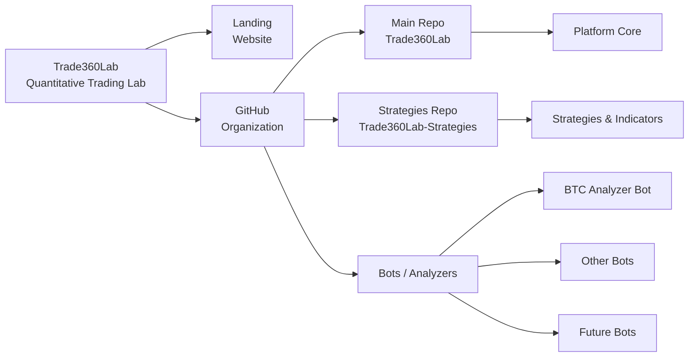

  

<h1 align="center">Quantitative trading lab for building and testing strategies</h1>

  <a href="https://t360lab.tech">Главная</a> |
  <a href="https://t360lab.tech/docs">Документация</a> |
  <a href="https://t.me/trading360l">Telegram</a> 

<a href="https://github.com/Trade360Lab/Trade360Lab">Основной репозиторий</a> |
<a href="https://github.com/Trade360Lab/Trade360Lab-Strategies.git">Стратегии и индикаторы</a>

<h2 align="center">Стек технологий</h2>

<table align="center">
  <tr>
    <td align="center"><b>Frontend</b></td>
    <td align="center"><b>Backend</b></td>
    <td align="center"><b>CI / DevOps</b></td>
  </tr>

  <tr>
    <td align="center">
       
       
       
       
       
      
    </td>
    <td align="center">
       
       
       
       
      
    </td>
    <td align="center">
       
      
    </td>
  </tr>
</table>

<h2 align="center">Roadmap of Trade360Lab</h2>

<table width="100%">
<tr>

<td valign="top" width="50%" align="center">

### Platform Core

<table width="100%" style="font-size:12px;">
<tr><th>Feature</th><th>Status</th></tr>
<tr><td>Monorepo structure</td><td></td></tr>
<tr><td>Docker Compose full stack</td><td></td></tr>
<tr><td>Java API control plane</td><td></td></tr>
<tr><td>Python execution engine</td><td></td></tr>
<tr><td>PostgreSQL persistence</td><td></td></tr>
<tr><td>Readiness dashboard</td><td></td></tr>
<tr><td>Event-driven engine</td><td></td></tr>
</table>

</td>

<td valign="top" width="50%" align="center">

### Data & Execution

<table width="100%" style="font-size:12px;">
<tr><th>Feature</th><th>Status</th></tr>
<tr><td>Market data import</td><td></td></tr>
<tr><td>Binance candles parser</td><td></td></tr>
<tr><td>Dataset snapshots</td><td></td></tr>
<tr><td>Dataset quality reports</td><td></td></tr>
<tr><td>Queued execution jobs</td><td></td></tr>
<tr><td>Run snapshots / reproducibility</td><td></td></tr>
<tr><td>Optimization engine</td><td></td></tr>
</table>

</td>

</tr>

<tr>

<td valign="top" align="center">

### Strategies & Backtesting

<table width="100%" style="font-size:12px;">
<tr><th>Feature</th><th>Status</th></tr>
<tr><td>Strategy upload</td><td></td></tr>
<tr><td>Strategy validation</td><td></td></tr>
<tr><td>Strategy registry</td><td></td></tr>
<tr><td>Strategy versioning</td><td></td></tr>
<tr><td>Strategy templates</td><td></td></tr>
<tr><td>Parameter presets</td><td></td></tr>
<tr><td>Backtest execution</td><td></td></tr>
</table>

</td>

<td valign="top" align="center">

### Analytics & Reports

<table width="100%" style="font-size:12px;">
<tr><th>Feature</th><th>Status</th></tr>
<tr><td>Run metrics</td><td></td></tr>
<tr><td>Equity curve artifacts</td><td></td></tr>
<tr><td>Trades export</td><td></td></tr>
<tr><td>Run report JSON</td><td></td></tr>
<tr><td>Compare runs UI</td><td></td></tr>
<tr><td>Diagnostics bundle</td><td></td></tr>
<tr><td>Advanced portfolio analytics</td><td></td></tr>
</table>

</td>

</tr>

<tr>

<td valign="top" align="center">

### Trading

<table width="100%" style="font-size:12px;">
<tr><th>Feature</th><th>Status</th></tr>
<tr><td>Paper trading sessions</td><td></td></tr>
<tr><td>Paper orders / fills</td><td></td></tr>
<tr><td>Paper positions / balance</td><td></td></tr>
<tr><td>Live trading foundation</td><td></td></tr>
<tr><td>Live risk gates</td><td></td></tr>
<tr><td>Kill switch / circuit breaker</td><td></td></tr>
<tr><td>Production live trading</td><td></td></tr>
</table>

</td>

<td valign="top" align="center">

### Security, Ops & AI

<table width="100%" style="font-size:12px;">
<tr><th>Feature</th><th>Status</th></tr>
<tr><td>JWT authentication</td><td></td></tr>
<tr><td>User-scoped resources</td><td></td></tr>
<tr><td>Internal API secret protection</td><td></td></tr>
<tr><td>CI quality gates</td><td></td></tr>
<tr><td>Release / safety workflows</td><td></td></tr>
<tr><td>ML feature engineering</td><td></td></tr>
<tr><td>Model training / inference</td><td></td></tr>
</table>

</td>

</tr>
</table>

---

  Build. Test. Explore.  
  GNU GPL v3 License

