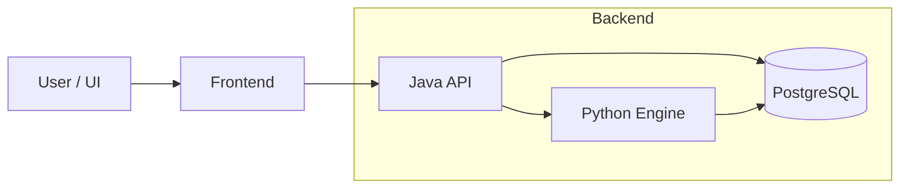

  

<h1 align="center">Trading research platform</h1>

  <a href="https://t360lab.tech">Главная</a> |
  <a href="https://t.me/trading360l">Telegram</a> |
  <a href="https://github.com/Trade360Lab/Trade360Lab">Основной репозиторий</a>

<h2 align="center">Архитектура</h2>

<h2 align="center">Стек технологий</h2>

<table align="center">
  <tr>
    <td align="center"><b>Frontend</b></td>
    <td align="center"><b>Backend</b></td>
    <td align="center"><b>CI / DevOps</b></td>
  </tr>

  <tr>
    <td align="center">
       
       
       
       
       
      
    </td>
    <td align="center">
       
       
       
       
      
    </td>
    <td align="center">
       
      
    </td>
  </tr>
</table>

<h2 align="center">Roadmap of Trade360Lab</h2>

<table width="100%">
<tr>

<td valign="top" width="50%" align="center">

### Core Engine

<table width="100%" style="font-size:12px;">
<tr><th>Feature</th><th>Status</th></tr>
<tr><td>Data pipeline</td><td></td></tr>
<tr><td>Strategy contract</td><td></td></tr>
<tr><td>Backtesting engine</td><td></td></tr>
<tr><td>Java orchestration</td><td></td></tr>
<tr><td>Optimization engine</td><td></td></tr>
<tr><td>Event-driven engine</td><td></td></tr>
</table>

</td>

<td valign="top" width="50%" align="center">

### Trading

<table width="100%" style="font-size:12px;">
<tr><th>Feature</th><th>Status</th></tr>
<tr><td>Paper trading</td><td></td></tr>
<tr><td>Live trading</td><td></td></tr>
<tr><td>Order management system</td><td></td></tr>
<tr><td>Risk management</td><td></td></tr>
<tr><td>Position sizing</td><td></td></tr>
</table>

</td>

</tr>

<tr>

<td valign="top" align="center">

### ML / AI

<table width="100%" style="font-size:12px;">
<tr><th>Feature</th><th>Status</th></tr>
<tr><td>Feature engineering</td><td></td></tr>
<tr><td>Model training</td><td></td></tr>
<tr><td>Online inference</td><td></td></tr>
<tr><td>Meta-labeling</td><td></td></tr>
<tr><td>Reinforcement learning</td><td></td></tr>
</table>

</td>

<td valign="top" align="center">

### Analytics

<table width="100%" style="font-size:12px;">
<tr><th>Feature</th><th>Status</th></tr>
<tr><td>Equity curve</td><td></td></tr>
<tr><td>Metrics (Sharpe, Sortino)</td><td></td></tr>
<tr><td>Drawdown analysis</td><td></td></tr>
<tr><td>Trade logs</td><td></td></tr>
</table>

</td>

</tr>
</table>

---

  Build. Test. Explore.  
  GNU GPL v3 License

