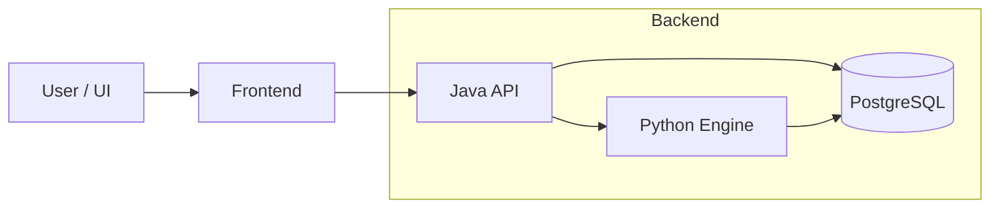

  

<h1 align="center">Trading research platform</h1>

  <a href="https://t360lab.tech">Главная</a> |
  <a href="https://t360lab.tech/">Документация</a> |
  <a href="https://t.me/trading360l">Telegram</a> |
  <a href="https://github.com/Trade360Lab/Trade360Lab">Основной репозиторий</a>

<h2 align="center">Архитектура</h2>

<h2 align="center">Стек технологий</h2>

<table align="center">
  <tr>
    <td align="center"><b>Frontend</b></td>
    <td align="center"><b>Backend</b></td>
    <td align="center"><b>CI / DevOps</b></td>
  </tr>

  <tr>
    <td align="center">
       
       
       
       
       
      
    </td>
    <td align="center">
       
       
       
       
      
    </td>
    <td align="center">
       
      
    </td>
  </tr>
</table>

<h2 align="center">Roadmap</h2>

* [x] Data pipeline
* [x] Strategy contract
* [x] Backtesting engine
* [x] Java orchestration
* [ ] Optimization engine
* [ ] Paper trading
* [ ] ML / AI layer

---

  Build. Test. Explore.  
  GNU GPL v3 License

